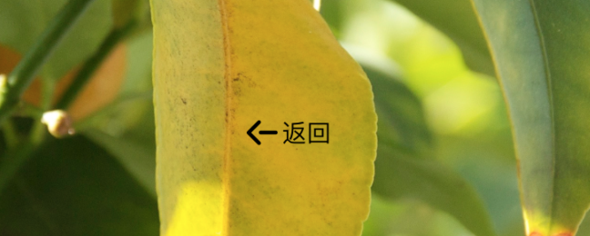

# Spotlight （聚光灯）

## 什么要写这个东东？

现在的 UI 非常喜欢使用浸入式设计，比如说大图片背景之上放一个按钮，效果图看起来非常漂亮，高端大气上档次。但是 UI 往往忘记了这样一个事实，app 中的图片是会变的，效果图中使用一张深色的背景图片，配上白色的按钮看起来非常漂亮，但当背景图变成浅色的背景时怎么办？你马上连按钮都看不见了。

于是必须找出一种方法，能够从背景图片中找出图片的主色调，然后根据这个主色调动态调整按钮文字或图片颜色。

这个过程大概可以分成 3 个任务：

1. 从 UIImage 中找出这张图片的主色调

	这个任务我找到了一个第三方开源库 [iOSPalette](https://github.com/tangdiforx/iOSPalette)，非常感谢 iOSPalette 的作者。我 Fork 了这个库，本来想修改后直接 pull request。但是后面觉得也不合适，因为原来的库叫做 iOSPalette，该库的目标是读取位图中的颜色值进行计算，和 UIKit 并没有太直接的关系。因此重新创建了这个库。此外，在计算主色调时，为了使计算更加准确，我没有直接用整张背景图进行计算，而是对背景图所在的 View 进行截屏，然后缩小采样区域，只截取按钮 frame 所遮盖住的部分。
2. 根据主色调计算出一个互补色，用它来作为按钮图片的颜色。

	算法是从网上找到，很简单，具体你可以看 UIColor+Complementary 这个分类。后面感觉互补色的效果看起来不是很好，于是又根据主色调的 RGB 值计算颜色的流明度，根据流明度的不同，返回黑色或者白色。
3. 将图片按钮的颜色替换成指定色（黑色或者白色）。

	这里使用了过去在项目中用过的一个分类 UIImage+Extension。

## 用法

最终为 UIButton 和 UILabel 封装了两个分类 Spotlight，你只需在UIButton/UILabel 上调用分类的 lightingWithOption: backgroundView :方法即可。比如：


### UIButton+Spotlight

分类方法 lightingWithOption: backgroundView: 方法的第一个参数是 ButtonSpotlightOption 对象（继承 SpotlightOption 类）。通过这个参数允许你指定一些选项，不同的选项会导致不同的效果。

```
ButtonSpotlightOption* option = [ButtonSpotlightOption new];
option.lightingText = YES;// 默认 NO
[self.btBack lightingWithOption:option backgroundView:self.ivPhotoPreview];
        
```

这样，按钮的颜色就会自动适配随背景 view 的主色。看效果：




### UILabel+Spotlight

和 UIButton+Spotlight 分类一样，这个分类同样有一个lightingWithOption: backgroundView: 方法，只不过它的第一个参数变成了 LabelSpotlightOption 对象（同样继承了 SpotlightOption 类）。这个选项允许配置一些针对 UILabel 的特殊效果，比如在文字的下方增加一个半透明的背景图层，用于增强背景的显示。比如：

```
// 在 label 下增加一层颜色背景
opt.enhancedBackgroundRect = r; // 背景所在的位置大小
opt.enhancedBackgroundAlpha = 0.5; // 背景颜色透明度
opt.blendEnhancedBackground = YES;// 是否融合背景主题色，默认 NO
```

其中 blendEnhancedBackground 选项设置为 YES 会使用背景图片主题色作为增强背景图层的颜色，如下图所示：


如果 blendEnhancedBackground 为 NO（默认），则会根据不同情况分别使用黑色和白色作为增强背景图层的颜色，如下图所示：


## 安装

项目是开源的，直接拷贝 Spotlight 目录中的 .m/.h 文件拖到你的项目中并导入对应的头文件即可。


